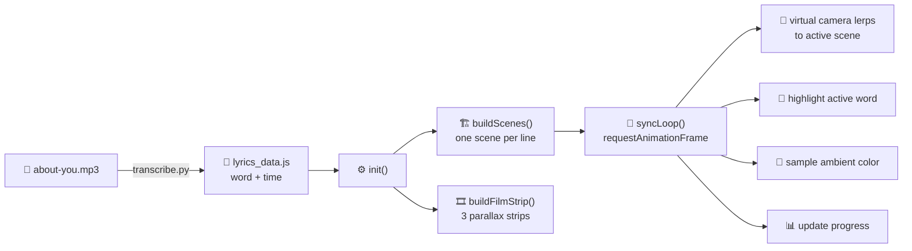

<!-- ─────────────────────────────  HEADER  ───────────────────────────── -->
<div align="center">


<a href="https://github.com/Revaldoo22/about-you">
  
</a>

<br/>

<!-- Tech badges -->


<br/><br/>

<!-- Repo stats badges -->


</div>

<br/>

> **A drop-in, zero-dependency template for building an interactive cinematic lyric video on the web.**
> Bring your own song and photos — the virtual camera, word-by-word lyric sync, film-strip background, ambient color, and animated favicon come for free.

<div align="center">

`✦ Made with love — Copyright © Revaldoo22 ✦`

</div>

---

## 📑 Table of Contents

- [✨ Features](#-features)
- [🎬 Live Demo](#-live-demo)
- [🚀 Quick Start](#-quick-start)
- [🎵 Using Your Own Song](#-using-your-own-song)
- [🖼️ Using Your Own Photos](#️-using-your-own-photos)
- [🧠 How It Works](#-how-it-works)
- [🗂️ Project Structure](#️-project-structure)
- [🎛️ Configuration Cheatsheet](#️-configuration-cheatsheet)
- [⌨️ Keyboard Shortcuts](#️-keyboard-shortcuts)
- [☁️ Deploy](#️-deploy)
- [🩹 Troubleshooting](#-troubleshooting)
- [🤝 Contributing](#-contributing)
- [📜 License](#-license)

---

## ✨ Features

<table>
<tr>
<td width="50%">

### 🎥 Virtual Camera
A single "camera" smoothly **pans, drifts, and tilts** across an infinite canvas of scenes, arriving on each lyric line 1.8 s before it's sung (look-ahead easing).

</td>
<td width="50%">

### 🎤 Word-Level Sync
Every **word** highlights in time with the vocal, powered by OpenAI **Whisper** word-timestamps — with a graceful interpolated fallback if no data is present.

</td>
</tr>
<tr>
<td width="50%">

### 🎞️ Film-Strip Background
Three parallax film strips (slanted-up, slanted-down, horizontal) scroll behind the scenes for a **retro cinema** feel, with sprocket holes and grain.

</td>
<td width="50%">

### 🌈 Ambient Color
The active photo is sampled live and its dominant color **bleeds into the glow** around the scene via CSS custom properties.

</td>
</tr>
<tr>
<td width="50%">

### 💿 Animated Favicon
A tiny canvas-drawn **spinning vinyl with a blushing heart** and floating music note — rendered frame-by-frame in the browser tab.

</td>
<td width="50%">

### 📱 Responsive & Touch
Layout, camera offsets, and a Spotify-style player card adapt to mobile. Full **mouse + touch** seeking on both progress bars.

</td>
</tr>
</table>

---

## 🎬 Live Demo

```
▶  Open index.html  →  press Play  →  watch the camera glide through your lyrics
```

> 💡 **Tip:** Serve over a local web server (not `file://`) so the audio Blob and photos load correctly. See [Quick Start](#-quick-start).

---

## 🚀 Quick Start

```bash
# 1. Use this template (green "Use this template" button) or clone it
git clone https://github.com/Revaldoo22/about-you.git
cd about-you

# 2. Serve locally — pick ANY one of these:
python -m http.server 8000          # Python 3
npx serve .                         # Node
php -S localhost:8000               # PHP

# 3. Open in your browser
#    http://localhost:8000
```

That's it — no `npm install`, no build step, no framework. 🎉

---

## 🎵 Using Your Own Song

The template includes a demo track. To use your **own** song:

1. Replace **`about-you.mp3`** in the project root with your track
   *(or rename it and update the `<audio>` `src` in [`index.html`](index.html)).*

2. Generate word-level timestamps with the included Whisper script:

   ```bash
   pip install -U openai-whisper
   python transcribe.py about-you.mp3
   ```

   This writes **`lyrics_data.js`** — an array of `{ word, time }` objects that the app loads automatically.

3. Refresh the page. The lyrics now sync to your song. 🎶

> **No Python?** No problem. Edit the `FALLBACK_LINE_DATA` array in [`app.js`](app.js) by hand — one line per `{ time, text }` — and the app will interpolate word timings for you.

---

## 🖼️ Using Your Own Photos

The `photos/` folder ships with **10 royalty-free placeholder images** (`scene-0.jpeg` … `scene-9.jpeg`) from [Lorem Picsum](https://picsum.photos).

To use your own, simply **replace them** keeping the same names:

```
photos/
├── scene-0.jpeg   ← lyric line 1
├── scene-1.jpeg   ← lyric line 2
├── ...
└── scene-9.jpeg   ← lyric line 10
```

**Good to know**

- Each scene maps to one lyric **line**, in order.
- Photos are shown at their **original aspect ratio** (no cropping).
- **Portrait** photos are auto-shrunk to 50 % width so they don't tower — list their indices in the `PORTRAIT_SCENES` set in [`app.js`](app.js):

  ```js
  // Portrait scenes (height > width) — shrink to 50% width.
  const PORTRAIT_SCENES = new Set([0, 1, 3, 4, 6, 8]);
  ```

- Want **video** scenes? Drop a `scene-N.mp4` next to the image — the app prefers video automatically and falls back to the image if it fails to load.

---

## 🧠 How It Works



1. **`init()`** picks the lyric source (`window.whisperLyrics`, else interpolated fallback) and splits lines on gaps > 2.2 s.
2. **`buildScenes()`** lays out one scene per lyric line in a zig-zag down an infinite canvas.
3. **`syncLoop()`** runs every animation frame: it finds the active scene from `audio.currentTime`, eases the camera toward it (with 1.8 s look-ahead), highlights the current word, samples the ambient color, and updates the progress bars.

---

## 🗂️ Project Structure

```
about-you/
├── index.html          # Markup: film strips, camera, player card, <audio>
├── app.js              # All logic: scenes, camera, sync loop, controls, favicon
├── style.css           # ~1.8k lines of cinematic styling & responsive layout
├── lyrics_data.js      # Auto-generated word timestamps (window.whisperLyrics)
├── transcribe.py       # Offline: Whisper → lyrics_data.js
├── about.jpg           # Album art (placeholder)
├── about-you.mp3       # Demo audio — swap for your own track
└── photos/
    └── scene-0…9.jpeg  # Placeholder scene images (replace with your own)
```

---

## 🎛️ Configuration Cheatsheet

All knobs live at the top of [`app.js`](app.js) and in [`style.css`](style.css):

| What | Where | Default |
|------|-------|---------|
| Camera follow speed | `CAM_LERP` in `app.js` | `0.04` |
| Camera rotation speed | `CAM_ROT_LERP` in `app.js` | `0.03` |
| Portrait scene indices | `PORTRAIT_SCENES` in `app.js` | `{0,1,3,4,6,8}` |
| Line-split gap threshold | `timeGap > 2.2` in `init()` | `2.2 s` |
| Look-ahead lead time | `next.startTime - 1.8` in `syncLoop()` | `1.8 s` |
| Scene photo filter | `.scene-photo { filter }` in `style.css` | brightness/contrast/grayscale |
| Ambient glow strength | `.scene-active .scene-photo-wrap` box-shadow | `0.45` alpha |

---

## ⌨️ Keyboard Shortcuts

| Key | Action |
|-----|--------|
| <kbd>Space</kbd> | Play / Pause |
| <kbd>←</kbd> | Seek −5 s |
| <kbd>→</kbd> | Seek +5 s |
| <kbd>↑</kbd> | Volume +10 % |
| <kbd>↓</kbd> | Volume −10 % |

---

## ☁️ Deploy

This is a static site — deploy anywhere.

<div align="center">

[](https://vercel.com/new/clone?repository-url=https://github.com/Revaldoo22/about-you)

</div>

```bash
# Vercel
npm i -g vercel && vercel

# GitHub Pages — just push and enable Pages on the repo (root)
# Netlify — drag & drop the folder into the Netlify dashboard
```

---

## 🩹 Troubleshooting

<details>
<summary><b>Audio won't play / can't seek</b></summary>

<br/>

Browsers block autoplay and restrict `file://` audio. **Serve over HTTP** (see [Quick Start](#-quick-start)) and click Play once to grant playback.

</details>

<details>
<summary><b>Lyrics are out of sync</b></summary>

<br/>

Re-run `python transcribe.py about-you.mp3` with a larger Whisper model (`small`, `medium`) — edit `model_size` in [`transcribe.py`](transcribe.py). Or hand-tune times in `lyrics_data.js`.

</details>

<details>
<summary><b>My photo is cropped / too tall</b></summary>

<br/>

Photos render at original ratio. If a portrait photo is too tall, add its index to `PORTRAIT_SCENES` in [`app.js`](app.js) to shrink it to 50 % width.

</details>

<details>
<summary><b>Old CSS/JS keeps loading</b></summary>

<br/>

Bump the cache-busting query in [`index.html`](index.html): `style.css?v=NN` and `app.js?v=NN`.

</details>

---

## 🤝 Contributing

Contributions, issues, and feature requests are welcome!

1. Fork the repo
2. Create a branch (`git checkout -b feat/amazing`)
3. Commit your changes (`git commit -m 'feat: add amazing thing'`)
4. Push (`git push origin feat/amazing`)
5. Open a Pull Request

---

## 📜 License

Released under the **MIT License** — free to use, modify, and share.

> ⚠️ Placeholder images are royalty-free (Lorem Picsum). You are responsible for the licensing of any song or media you swap in.

---

<!-- ─────────────────────────────  FOOTER  ───────────────────────────── -->
<div align="center">


### 💜 Copyright © <a href="https://github.com/Revaldoo22">Revaldoo22</a>

<sub>Built with pure HTML · CSS · JavaScript — no frameworks, no build step.</sub><br/>
<sub>If you like this template, consider leaving a ⭐ — it means a lot!</sub>

<br/>

<a href="https://github.com/Revaldoo22">
  
</a>

</div>
